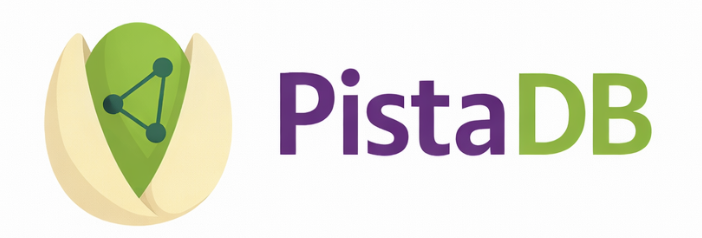

<div align="center">

[English](./README.md) · [中文](./README_CN.md)



<p><strong>The embedded vector database for LLM-native applications.</strong><br>
RAG-ready · Zero dependencies · Single-file storage · MIT Licensed</p>

[](https://opensource.org/licenses/MIT)
[](https://en.wikipedia.org/wiki/C99)
[]()
[]()
[]()
[]()
[]()
[]()
[]()

</div>

---

> **Every LLM application eventually needs a vector database.**
> For retrieval-augmented generation (RAG), semantic search, agent memory, or embedding caches —
> the standard answer is a cloud service or a containerized cluster. PistaDB disagrees.
>
> Small, dense, and full of value — like the nut it's named after —
> **PistaDB gives you a production-grade vector store in a single `.pst` file and a C library with zero dependencies.**
> Ship it inside a desktop app. Bundle it in an edge device. Drop it next to your Python script.
> No Docker. No API keys. No data leaving the machine.

---

## Why PistaDB?

| | PistaDB | Cloud / Server Vector DB |
|---|---|---|
| Deployment | Copy a `.dll` / `.so` | Docker, Kubernetes, cloud subscriptions |
| Storage | One `.pst` file | Separate data + WAL + config + sidecar files |
| Privacy | **All data stays local** | Embeddings sent over the network |
| Memory | Configurable, minimal | GBs of JVM / runtime overhead |
| Dependencies | **None** (pure C99) | Dozens of packages |
| Latency | **Sub-millisecond** on a laptop | Network round-trips |
| Cost | Free forever (MIT) | Per-query or per-vector pricing |

PistaDB is purpose-built for **local RAG pipelines, offline AI agents, privacy-sensitive applications, edge inference, and anywhere shipping a full vector database cluster is impractical** — which, honestly, is most places.

---

## Key Features

### 8 Production-Ready Index Algorithms

| Index | Algorithm | Best For |
|-------|-----------|----------|
| `LINEAR` | Brute-force exact scan | Ground truth, small embedding sets |
| `HNSW` | Hierarchical Navigable Small World | **Recommended for RAG** — best speed/recall tradeoff |
| `IVF` | Inverted File Index (k-means) | Large knowledge bases with a training budget |
| `IVF_PQ` | IVF + Product Quantization | Memory-constrained deployments |
| `DISKANN` | Vamana graph (DiskANN) | Billion-scale embedding collections |
| `LSH` | Locality-Sensitive Hashing | Ultra-low memory footprint |
| `SCANN` | Anisotropic Vector Quantization (Google ScaNN) | Maximum recall on MIPS / cosine workloads |
| `SQ` | Scalar Quantization (uint8) | **4× memory & storage savings**, no training needed |

### 5 Distance Metrics — All LLM Embedding Models Covered

| Metric | LLM / Embedding Use Case |
|--------|--------------------------|
| `COSINE` | **Text embeddings** — OpenAI `text-embedding-3`, Cohere, `sentence-transformers`, BGE, GTE |
| `IP` | Inner product — embeddings already L2-normalised (same result as cosine, faster) |
| `L2` | Image / multimodal embeddings (CLIP, ImageBind) |
| `L1` | Sparse feature vectors, BM25-style hybrid retrieval |
| `HAMMING` | Binary embeddings, hash-based deduplication |

### Production Feature Set

- **SIMD-accelerated** distance kernels — AVX2+FMA on x86-64, NEON on ARM, runtime-dispatched (4–8× scalar)
- **VecStore chunked storage** — no scale ceiling; verified at 10 M vectors (HNSW) and 9 M full CRUD (IVF)
- **Transactions** — ACID-style atomic multi-op groups with full undo-on-failure rollback
- **Multi-threaded batch insert** — thread-pool + ring-buffer API for high-throughput embedding pipelines
- **Embedding cache** — persistent LRU cache (`.pcc`) that eliminates redundant model calls
- **Single-file storage** — CRC32-verified `.pst` format (lookup-table accelerated); atomic save, no partial writes
- **O(1) vector count** — cached active-vector count maintained on insert/delete, no linear scans
- **Hardened internals** — bitset bounds checks, heap empty-access guards, HNSW neighbor bounds validation on file load
- **9 language bindings** — C, C++, Python, Go, Java, Kotlin, Swift, Objective-C, C#, Rust, WASM
- **109 / 109 tests passing** across all features and platforms

---

## Language & Platform Support

| Language | Binding mechanism | Where to find it |
|---|---|---|
| **C / C++** | Direct `#include` | `src/pistadb.h` / `wrap/cpp/pistadb.hpp` |
| **Python** | `ctypes` (no Cython) | `wrap/python/` |
| **Go** | CGO | `wrap/go/` |
| **Java** | JNI | `wrap/android/src/main/java/` |
| **Kotlin** | JNI + extension functions | `wrap/android/src/main/kotlin/` |
| **Objective-C** | Direct C interop | `wrap/ios/Sources/PistaDBObjC/` |
| **Swift** | ObjC bridge | `wrap/ios/Sources/PistaDB/` |
| **C#** | P/Invoke | `wrap/csharp/` |
| **Rust** | FFI (`extern "C"`) | `wrap/rust/` |
| **WASM** | Emscripten / Embind | `wrap/wasm/` |

| Platform | Library output | ABI targets |
|---|---|---|
| **Windows** | `pistadb.dll` | x86_64 |
| **Linux** | `libpistadb.so` | x86_64, aarch64 |
| **macOS** | `libpistadb.dylib` | x86_64, arm64 |
| **Android** | `libpistadb_jni.so` | arm64-v8a, armeabi-v7a, x86_64, x86 |
| **iOS / macOS** | Static library (SPM) | arm64, arm64-Simulator, x86_64-Simulator |
| **WASM** | `.wasm` | — *(planned)* |

---

## Installation

### 1. Build the C Library

**Windows (MSVC):**
```bat
scripts\windows\build.bat Release
```

**Linux (GCC / Clang):**
```bash
bash scripts/linux/build.sh Release
```

**macOS (Apple Clang):**
```bash
bash scripts/macos/build.sh Release
```

Each script auto-detects the host architecture and copies the artifact into
`libs/<os>/<arch>/` (e.g. `libs/linux/x86_64/libpistadb.so`). The legacy
`build.bat` / `build.sh` at the repo root still work — they forward to the
per-OS scripts. Produced library has **zero external dependencies**.

### 2. Install the Python Binding

```bash
pip install -e wrap/python/
```

The wrapper auto-discovers `libs/<os>/<arch>/` at import time, so no
environment variable is required when working inside this checkout.

> **Using PistaDB from a separate Python project?** See
> [INTEGRATION.md](INTEGRATION.md) for the end-to-end Linux deployment flow
> (vendoring, `PISTADB_LIB_DIR` / `PISTADB_LIB_PATH`, Docker recipe).

No Rust compiler. No CMake for the Python step. No surprises.

### 3. Android Integration

Open `wrap/android/` as a library module in Android Studio, or declare it in `settings.gradle`:

```groovy
include ':android'
project(':android').projectDir = new File('<path-to-PistaDB>/wrap/android')
```

The NDK build is handled automatically by `wrap/android/CMakeLists.txt`. Ensure NDK `26.x` is installed and `ndkVersion` in `wrap/android/build.gradle` matches.

### 4. iOS / macOS Integration (Swift Package Manager)

In Xcode: **File → Add Package Dependencies** → point to this repository (or local checkout).
Or add to your own `Package.swift`:

```swift
.package(path: "../PistaDB")
```

The `Package.swift` at the project root declares three targets — `CPistaDB` (C core), `PistaDBObjC`, and `PistaDB` (Swift) — wired together automatically by SPM.

### 5. WASM Integration

```bash
source /path/to/emsdk/emsdk_env.sh
cd wrap/wasm && bash build.sh
# → wrap/wasm/build/pistadb.js + pistadb.wasm
```

Serve both files from the same HTTP origin, or use directly in Node.js.

### 6. C++ Integration

```cmake
add_subdirectory(PistaDB)
add_subdirectory(PistaDB/wrap/cpp)
target_link_libraries(my_app PRIVATE pistadb_cpp)
```

### 7. Go Integration

```go
// go.mod
replace pistadb.io/go => ../PistaDB/wrap/go
```

```bash
export CGO_LDFLAGS="-L../PistaDB/build -lpistadb"
go get pistadb.io/go/pistadb
go build ./...
```

### 8. Rust Integration

```bash
cd wrap/rust
PISTADB_LIB_DIR=../../build cargo build --release
```

### 9. C# / .NET Integration

```xml
<!-- In your .csproj -->
<ItemGroup>
  <ProjectReference Include="../PistaDB/wrap/csharp/PistaDB.csproj" />
</ItemGroup>
```

```bash
# Windows: copy pistadb.dll next to your executable
copy build\Release\pistadb.dll MyApp\bin\Debug\net8.0\

# Linux: set LD_LIBRARY_PATH or copy libpistadb.so
export LD_LIBRARY_PATH=$PWD/build:$LD_LIBRARY_PATH
```

---

## Quick Start

```python
import numpy as np
from pistadb import PistaDB, Metric, Index, Params

params = Params(hnsw_M=16, hnsw_ef_construction=200, hnsw_ef_search=50)
db = PistaDB("mydb.pst", dim=1536, metric=Metric.COSINE, index=Index.HNSW, params=params)

vec = np.random.rand(1536).astype("float32")
db.insert(1, vec, label="chunk_0001")

query = np.random.rand(1536).astype("float32")
results = db.search(query, k=10)
for r in results:
    print(f"id={r.id}  dist={r.distance:.4f}  label={r.label!r}")

db.save()
db.close()
```

```python
# Context manager — auto-closed on exit
with PistaDB("docs.pst", dim=768, metric=Metric.COSINE) as db:
    db.insert(1, vec, label="document excerpt")
    results = db.search(query, k=5)
    db.save()
```

For more examples — RAG pipelines, agent memory, advanced indexes, transactions, batch insert, embedding cache, and per-language integration guides — see the docs below.

---

## Schema-Based Collections (Milvus-style)

The base `PistaDB` API stores `(id, label, vector)` triples — perfect when your
metadata fits in a 256-byte label. When you need **multiple typed fields per
row** (section, key, language, line number, token count, …) on top of the
embedding, the **`Collection`** layer adds a Milvus-compatible schema API:

- **`FieldSchema` / `CollectionSchema` / `DataType`** — declare INT64, VARCHAR,
  FLOAT, DOUBLE, BOOL, JSON, FLOAT_VECTOR fields with `is_primary` / `auto_id` /
  `max_length` / `dim` semantics that mirror `pymilvus` line for line.
- **`Collection.insert(rows)`** — accepts a list of dicts keyed by field name,
  validates types and lengths, auto-generates ids when `auto_id=True`.
- **`Collection.search(query, k, output_fields=…)`** — returns hits enriched
  with the projected scalar columns.
- **JSON sidecar (`<path>.meta.json`)** — vectors stay in the `.pst` file;
  scalar fields go to a sibling JSON file with a stable wire format, so a
  collection created from one language opens cleanly from any other.

```python
import numpy as np
from pistadb import (
    FieldSchema, DataType, create_collection,
    Metric, Index,
)

fields = [
    FieldSchema("lc_id",      DataType.INT64,        is_primary=True, auto_id=True),
    FieldSchema("lc_section", DataType.VARCHAR,      max_length=100),
    FieldSchema("lc_key",     DataType.VARCHAR,      max_length=200),
    FieldSchema("lc_lang",    DataType.VARCHAR,      max_length=10),
    FieldSchema("lc_lineno",  DataType.INT64),
    FieldSchema("lc_tokens",  DataType.INT64),
    FieldSchema("lc_vector",  DataType.FLOAT_VECTOR, dim=1536),
]
coll = create_collection(
    "common_text", fields, "Common text search",
    metric=Metric.COSINE, index=Index.HNSW, base_dir="./db",
)

ids = coll.insert([
    {"lc_section": "common", "lc_key": "btn_ok",
     "lc_lang": "en", "lc_lineno": 12, "lc_tokens": 3,
     "lc_vector": np.random.rand(1536).astype("float32")},
])

hits = coll.search(query, limit=10, output_fields=["lc_key", "lc_lang"])[0]
for h in hits:
    print(h.id, h.distance, h["lc_key"], h["lc_lang"])

coll.flush()                       # persist .pst + sidecar
coll.close()
```

A complete runnable port of the typical Milvus `create_database()` snippet
lives at [`examples/example_schema.py`](examples/example_schema.py).

The same API is available in every language wrapper:

```go
// Go — wrap/go/pistadb/schema.go
fields := []pistadb.FieldSchema{
    {Name: "lc_id", DType: pistadb.DTypeInt64, IsPrimary: true, AutoID: true},
    {Name: "lc_vector", DType: pistadb.DTypeFloatVector, Dim: 1536},
}
coll, _ := pistadb.CreateCollection("common_text", fields, "...",
    pistadb.CollectionOptions{Metric: pistadb.MetricCosine, Index: pistadb.IndexHNSW})
ids, _ := coll.Insert([]map[string]any{{"lc_vector": vec}})
hits, _ := coll.Search(query, 10, nil)
```

```rust
// Rust — cargo build --features schema
use pistadb::schema::{create_collection, CollectionOptions, DataType, FieldSchema};
use pistadb::{IndexType, Metric};

let fields = vec![
    FieldSchema { name: "lc_id".into(),     dtype: DataType::Int64,
                  is_primary: true, auto_id: true,    ..Default::default() },
    FieldSchema { name: "lc_section".into(),dtype: DataType::VarChar,
                  max_length: Some(100),             ..Default::default() },
    FieldSchema { name: "lc_vector".into(), dtype: DataType::FloatVector,
                  dim: Some(1536),                    ..Default::default() },
];
let coll = create_collection("common_text", fields, "Common text search",
    CollectionOptions { metric: Metric::Cosine, index: IndexType::HNSW,
                        base_dir: Some("./db".into()), ..Default::default() })?;
```

```csharp
// C# — wrap/csharp/Collection.cs
var fields = new[] {
    new FieldSchema("lc_id",     DataType.Int64,       isPrimary: true, autoId: true),
    new FieldSchema("lc_section",DataType.VarChar,     maxLength: 100),
    new FieldSchema("lc_vector", DataType.FloatVector, dim: 1536),
};
var coll = Collection.Create("common_text", fields, "Common text search",
    metric: Metric.Cosine, indexType: IndexType.HNSW, baseDir: "./db");
var ids = coll.Insert(new[] {
    new Dictionary<string, object?> {
        ["lc_section"] = "common",
        ["lc_vector"]  = vec,
    },
});
```

```cpp
// C++ — #include "pistadb_schema.hpp"
using namespace pistadb;
std::vector<FieldSchema> fields = {
    { "lc_id",     DataType::Int64,       /*primary=*/true, /*auto_id=*/true   },
    { "lc_section",DataType::VarChar,     false, false, /*max_length=*/100      },
    { "lc_vector", DataType::FloatVector, false, false, std::nullopt, /*dim=*/1536 },
};
auto coll = create_collection("common_text", std::move(fields), "Common text search",
    { Metric::Cosine, IndexType::HNSW, std::nullopt, std::string("./db") });
coll.insert({{ {"lc_section", Value::str("common")},
               {"lc_vector",  Value::floats(vec)} }});
```

```java
// Java — wrap/android/.../Collection.java
List<FieldSchema> fields = Arrays.asList(
    new FieldSchema.Builder("lc_id",     DataType.INT64).primary(true).autoId(true).build(),
    new FieldSchema.Builder("lc_vector", DataType.FLOAT_VECTOR).dim(1536).build());
Collection coll = Collection.create("common_text", fields, "...",
    new Collection.Options().metric(Metric.COSINE).index(IndexType.HNSW));
```

```kotlin
// Kotlin DSL — wrap/android/.../CollectionExtensions.kt
val coll = collection("common_text", fields = listOf(
    field("lc_id",     DataType.INT64) { primary(true).autoId(true) },
    field("lc_vector", DataType.FLOAT_VECTOR) { dim(1536) },
)) { metric = Metric.COSINE; index = IndexType.HNSW }
```

```swift
// Swift — wrap/ios/Sources/PistaDB/PistaDBSchema.swift
let fields: [FieldSchema] = [
    try FieldSchema(name: "lc_id",     dtype: .int64,       isPrimary: true, autoId: true),
    try FieldSchema(name: "lc_section",dtype: .varchar,     maxLength: 100),
    try FieldSchema(name: "lc_vector", dtype: .floatVector, dim: 1536),
]
let coll = try createCollection(
    name: "common_text", fields: fields, description: "Common text search",
    options: .init(metric: .cosine, indexType: .hnsw, baseDir: "./db"))
```

```javascript
// WASM — import from pistadb_schema.js, then attachSchema(M)
const fields = [
    new M.FieldSchema("lc_id",     M.DataType.INT64,        { isPrimary: true, autoId: true }),
    new M.FieldSchema("lc_section",M.DataType.VARCHAR,      { maxLength: 100 }),
    new M.FieldSchema("lc_vector", M.DataType.FLOAT_VECTOR, { dim: 1536 }),
];
const coll = M.createCollection("common_text", fields, "Common text search", {
    metric: M.Metric.Cosine, indexType: M.IndexType.HNSW,
});
coll.insert([{ lc_section: "common", lc_vector: new Float32Array(1536) }]);
```

> **Schema rules**: exactly one `is_primary` field (must be `INT64`), exactly
> one `FLOAT_VECTOR` field (with positive `dim`), unique field names. Validation
> happens at construction — the same constraints in every wrapper.

---

## Running Tests

```bash
# Windows
set PISTADB_LIB_DIR=build\Release
pytest tests\ -v

# Linux / macOS
PISTADB_LIB_DIR=build pytest tests/ -v
```

**109 / 109 tests passing** — recall benchmarks, roundtrip persistence, corrupt-file rejection, metric correctness, ScaNN two-phase search, and transaction atomicity / rollback.

---

## Shuckr — Visual Database Browser

**Shuckr** is a standalone GUI tool for visually browsing and managing PistaDB `.pst` files — inspired by [DB Browser for SQLite](https://sqlitebrowser.org/). Built with Python + PyQt6, it talks to the compiled native library (`pistadb.dll` / `libpistadb.so`) via ctypes.

**Features:** Create / open `.pst` files · Browse vectors with pagination · Insert / edit / delete vectors · k-NN search with random query generation · Database metadata & raw header inspection · Unsaved-changes tracking

### Quick Start

```bash
cd Shuckr
pip install -r requirements.txt
python main.py
```

Or on Windows, simply double-click `run.bat`.

### Screenshots

| Database Info | Browse Data | Search |
|:---:|:---:|:---:|
|  |  |  |

---

## Documentation

| Document | Contents |
|---|---|
| [docs/examples.md](docs/examples.md) | RAG pipelines, agent memory, all index types, transactions, batch insert, embedding cache |
| [docs/language-bindings.md](docs/language-bindings.md) | Android, iOS/macOS, .NET, WASM, C++, Rust, Go — full integration guides |
| [docs/benchmarks.md](docs/benchmarks.md) | Large-scale CRUD benchmarks, SIMD details, file format, project structure |

---

## Roadmap

- [ ] Filtered search with metadata predicates (filter by source, date, tag before ANN)
- [ ] LangChain and LlamaIndex integration (drop-in vectorstore)
- [ ] Hybrid search: dense vector + sparse BM25 re-ranking in a single query
- [ ] Full in-browser RAG pipeline via WASM (IDBFS persistence, SharedArrayBuffer workers)
- [ ] HTTP microserver mode (optional, single binary, for multi-process access)

---

## Contributing

Pull requests are warmly welcomed. Whether it's a new index algorithm, a language binding, a performance improvement, an LLM integration, or documentation — every contribution makes PistaDB better for the whole community.

1. Fork the repository
2. Create your feature branch (`git checkout -b feat/langchain-integration`)
3. Commit your changes
4. Open a Pull Request

Please ensure all 109 tests continue to pass before submitting.

---

<div align="center">
<strong>Built in C99 · C++ · WASM · Python · Go · Java · Kotlin · Swift · Objective-C · C# · Rust · Runs anywhere · Keeps your data private</strong><br>
<em>The best infrastructure for an LLM app is the kind you never have to think about.</em>
</div>
