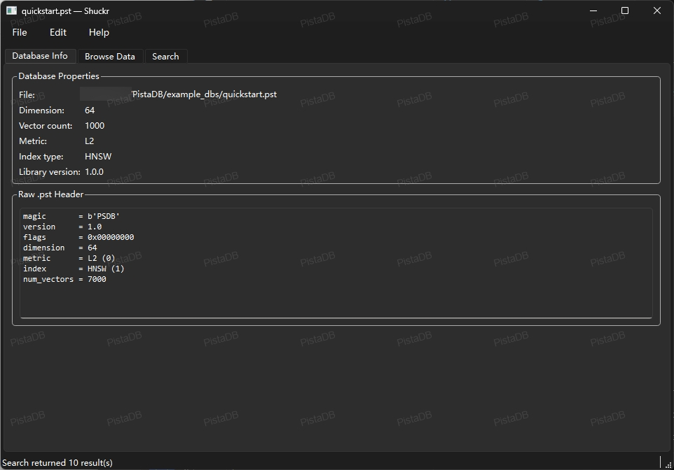
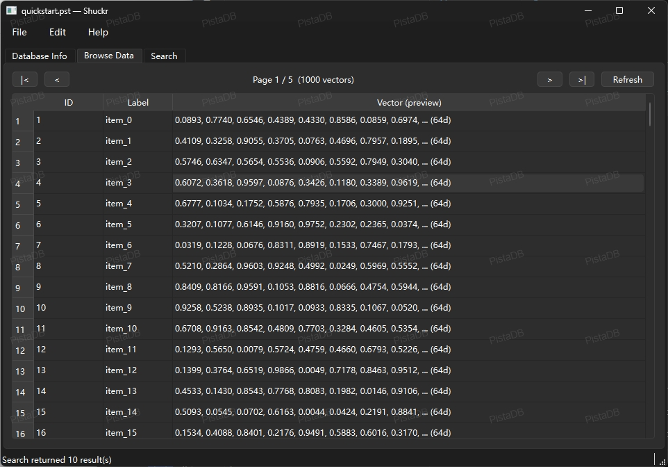
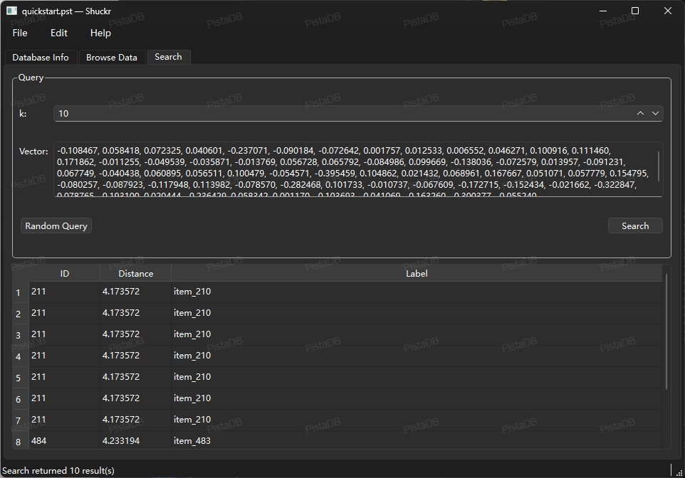

<div align="center">

[English](./README.md) · [中文](./README_CN.md)

<h1>🌰 PistaDB</h1>

<p><strong>专为 LLM 原生应用打造的嵌入式向量数据库。</strong><br>
RAG 就绪 · 零外部依赖 · 单文件存储 · MIT 开源协议</p>

[](https://opensource.org/licenses/MIT)
[](https://en.wikipedia.org/wiki/C99)
[]()
[]()
[]()
[]()
[]()
[]()
[]()

</div>

---

> **每一个 LLM 应用，最终都需要一个向量数据库。**
> 无论是检索增强生成（RAG）、语义搜索、智能体记忆，还是向量嵌入缓存——
> 通常的答案是云服务或容器化集群。PistaDB 给出了不同的答案。
>
> 小巧、密集、充满价值——就像它名字来源的那颗坚果——
> **PistaDB 将生产级向量存储浓缩进一个 `.pst` 文件和一个零依赖的 C 库。**
> 内嵌进桌面应用，部署到边缘设备，或直接和你的 Python 脚本放在一起。
> 无需 Docker，无需 API 密钥，数据永不离开本机。

---

## 为什么选择 PistaDB？

| | PistaDB | 云端 / 服务端向量数据库 |
|---|---|---|
| 部署方式 | 复制一个 `.dll` / `.so` | Docker、Kubernetes、云订阅 |
| 存储结构 | 单个 `.pst` 文件 | 数据文件 + WAL + 配置 + 附属文件 |
| 数据隐私 | **全部数据留在本地** | 向量嵌入通过网络传输 |
| 内存占用 | 可配置，极小 | JVM / 运行时动辄数 GB |
| 外部依赖 | **无**（纯 C99） | 数十个第三方包 |
| 查询延迟 | 笔记本上**亚毫秒级** | 网络往返延迟 |
| 使用成本 | 永久免费（MIT） | 按查询次数或向量数量计费 |

PistaDB 专为**本地 RAG 管道、离线 AI 智能体、隐私敏感应用、边缘推理，以及一切不适合部署完整向量集群的场景**而生——坦白说，大多数场景都是这样。

---

## 核心特性

### 7 种生产级索引算法

| 索引类型 | 算法 | 适用场景 |
|----------|------|----------|
| `LINEAR` | 暴力精确扫描 | 基准测试、小规模嵌入集 |
| `HNSW` | 分层可导航小世界图 | **RAG 首选** — 速度与召回率最佳平衡 |
| `IVF` | 倒排文件索引（k-means 聚类） | 有训练预算的大型知识库 |
| `IVF_PQ` | IVF + 乘积量化 | 内存受限的部署环境 |
| `DISKANN` | Vamana 图（DiskANN） | 十亿级向量集合 |
| `LSH` | 局部敏感哈希 | 极低内存占用场景 |
| `SCANN` | 各向异性向量量化（Google ScaNN） | MIPS / 余弦场景下的极致召回率 |

### 5 种距离度量——覆盖所有主流 LLM 嵌入模型

| 度量方式 | 适用场景 |
|----------|----------|
| `COSINE` | **文本嵌入**——OpenAI `text-embedding-3`、Cohere、`sentence-transformers`、BGE、GTE |
| `IP` | 内积——向量已 L2 归一化时与余弦等价，速度更快 |
| `L2` | 图像 / 多模态嵌入（CLIP、ImageBind） |
| `L1` | 稀疏特征向量、BM25 式混合检索 |
| `HAMMING` | 二值嵌入、哈希去重 |

### 生产级特性集

- **SIMD 加速**距离计算——x86-64 上 AVX2+FMA，ARM 上 NEON，运行时自动派发（比标量快 4–8×）
- **VecStore 分块存储**——无规模上限；已验证 HNSW 1000 万向量、IVF 900 万完整 CRUD
- **事务支持**——ACID 风格原子多操作批次，失败时完整回滚
- **多线程批量插入**——线程池 + 环形缓冲队列 API，适合高吞吐向量嵌入管道
- **嵌入缓存**——持久化 LRU 缓存（`.pcc`），自动消除重复模型调用
- **单文件存储**——CRC32 校验的 `.pst` 格式；原子写入，无部分写入
- **9 种语言绑定**——C、C++、Python、Go、Java、Kotlin、Swift、Objective-C、C#、Rust、WASM
- **109 / 109 测试全部通过**

---

## 语言与平台支持

| 语言 | 绑定机制 | 文件位置 |
|------|----------|----------|
| **C / C++** | 直接 `#include` | `src/pistadb.h` / `wrap/cpp/pistadb.hpp` |
| **Python** | `ctypes`（无 Cython） | `wrap/python/` |
| **Go** | CGO | `wrap/go/` |
| **Java** | JNI | `wrap/android/src/main/java/` |
| **Kotlin** | JNI + 扩展函数 | `wrap/android/src/main/kotlin/` |
| **Objective-C** | 直接 C 互操作 | `wrap/ios/Sources/PistaDBObjC/` |
| **Swift** | ObjC 桥接 | `wrap/ios/Sources/PistaDB/` |
| **C#** | P/Invoke | `wrap/csharp/` |
| **Rust** | FFI (`extern "C"`) | `wrap/rust/` |
| **WASM** | Emscripten / Embind | `wrap/wasm/` |

| 平台 | 产物 | ABI 目标 |
|------|------|----------|
| **Windows** | `pistadb.dll` | x86_64 |
| **Linux** | `libpistadb.so` | x86_64、aarch64 |
| **macOS** | `libpistadb.dylib` | x86_64、arm64 |
| **Android** | `libpistadb_jni.so` | arm64-v8a、armeabi-v7a、x86_64、x86 |
| **iOS / macOS** | 静态库（SPM） | arm64、arm64-Simulator、x86_64-Simulator |
| **WASM** | `.wasm` | — *(规划中)* |

---

## 安装部署

### 1. 构建 C 库

**Windows（MSVC）：**
```bat
build.bat Release
```

**Linux / macOS（GCC / Clang）：**
```bash
bash build.sh Release
```

产物为 `pistadb.dll`（Windows）或 `libpistadb.so`（Linux / macOS），**零外部依赖**。

### 2. 安装 Python 绑定

```bash
pip install -e wrap/python/
```

无需 Rust 编译器，无需单独运行 CMake，开箱即用。

### 3. Android 接入

在 Android Studio 中将 `wrap/android/` 作为 Library 模块导入，或在 `settings.gradle` 中声明：

```groovy
include ':android'
project(':android').projectDir = new File('<PistaDB 路径>/wrap/android')
```

NDK 构建由 `wrap/android/CMakeLists.txt` 自动处理。请确认已安装 NDK `26.x`，且 `wrap/android/build.gradle` 中的 `ndkVersion` 与之匹配。

### 4. iOS / macOS 接入（Swift Package Manager）

在 Xcode 中：**File → Add Package Dependencies**，指向本仓库或本地路径。
或直接在 `Package.swift` 中添加：

```swift
.package(path: "../PistaDB")
```

项目根目录的 `Package.swift` 声明了三个 Target——`CPistaDB`（C 核心）、`PistaDBObjC` 和 `PistaDB`（Swift）——SPM 自动完成依赖连接。

### 5. WASM 接入

```bash
source /path/to/emsdk/emsdk_env.sh
cd wrap/wasm && bash build.sh
# → wrap/wasm/build/pistadb.js + pistadb.wasm
```

从同一 HTTP 源提供两个文件，或直接在 Node.js 中使用。

### 6. C++ 接入

```cmake
add_subdirectory(PistaDB)
add_subdirectory(PistaDB/wrap/cpp)
target_link_libraries(my_app PRIVATE pistadb_cpp)
```

### 7. Go 接入

```go
// go.mod
replace pistadb.io/go => ../PistaDB/wrap/go
```

```bash
export CGO_LDFLAGS="-L../PistaDB/build -lpistadb"
go get pistadb.io/go/pistadb
go build ./...
```

### 8. Rust 接入

```bash
cd wrap/rust
PISTADB_LIB_DIR=../../build cargo build --release
```

### 9. C# / .NET 接入

```xml
<!-- 在你的 .csproj 中 -->
<ItemGroup>
  <ProjectReference Include="../PistaDB/wrap/csharp/PistaDB.csproj" />
</ItemGroup>
```

```bash
# Windows：将 pistadb.dll 复制到可执行文件旁
copy build\Release\pistadb.dll MyApp\bin\Debug\net8.0\

# Linux：设置 LD_LIBRARY_PATH 或复制 libpistadb.so
export LD_LIBRARY_PATH=$PWD/build:$LD_LIBRARY_PATH
```

---

## 快速入门

```python
import numpy as np
from pistadb import PistaDB, Metric, Index, Params

params = Params(hnsw_M=16, hnsw_ef_construction=200, hnsw_ef_search=50)
db = PistaDB("mydb.pst", dim=1536, metric=Metric.COSINE, index=Index.HNSW, params=params)

vec = np.random.rand(1536).astype("float32")
db.insert(1, vec, label="chunk_0001")

query = np.random.rand(1536).astype("float32")
results = db.search(query, k=10)
for r in results:
    print(f"id={r.id}  dist={r.distance:.4f}  label={r.label!r}")

db.save()
db.close()
```

```python
# 上下文管理器——退出时自动关闭
with PistaDB("docs.pst", dim=768, metric=Metric.COSINE) as db:
    db.insert(1, vec, label="文档片段")
    results = db.search(query, k=5)
    db.save()
```

更多示例——RAG 管道、智能体记忆、高级索引、事务、批量插入、嵌入缓存及各语言集成指南，请参阅下方文档。

---

## 运行测试

```bash
# Windows
set PISTADB_LIB_DIR=build\Release
pytest tests\ -v

# Linux / macOS
PISTADB_LIB_DIR=build pytest tests/ -v
```

**109 / 109 测试全部通过**——涵盖召回率基准、持久化往返、损坏文件检测、度量正确性、ScaNN 两阶段搜索及事务原子性 / 回滚。

---

## Shuckr — 可视化数据库浏览器

**Shuckr** 是一个独立的 GUI 工具，用于可视化浏览和管理 PistaDB `.pst` 文件——灵感源自 [DB Browser for SQLite](https://sqlitebrowser.org/)。基于 Python + PyQt6 构建，通过 ctypes 调用编译好的本地库（`pistadb.dll` / `libpistadb.so`）。

**功能：** 创建 / 打开 `.pst` 文件 · 分页浏览向量数据 · 插入 / 编辑 / 删除向量 · k-NN 搜索与随机查询生成 · 数据库元信息与原始文件头查看 · 未保存更改追踪

### 快速启动

```bash
cd Shuckr
pip install -r requirements.txt
python main.py
```

Windows 用户也可直接双击 `run.bat` 启动。

### 界面截图

| 数据库信息 | 数据浏览 | 向量搜索 |
|:---:|:---:|:---:|
|  |  |  |

---

## 文档

| 文档 | 内容 |
|------|------|
| [docs/examples_cn.md](docs/examples_cn.md) | RAG 管道、智能体记忆、所有索引类型、事务、批量插入、嵌入缓存 |
| [docs/language-bindings_cn.md](docs/language-bindings_cn.md) | Android、iOS/macOS、.NET、WASM、C++、Rust、Go 完整集成指南 |
| [docs/benchmarks_cn.md](docs/benchmarks_cn.md) | 大规模 CRUD 基准、SIMD 内核细节、文件格式、项目结构 |

---

## 路线图

- [ ] 元数据谓词过滤搜索（在 ANN 前按来源、日期、标签过滤）
- [ ] LangChain 和 LlamaIndex 集成（即插即用的 vectorstore）
- [ ] 混合搜索：密集向量 + 稀疏 BM25 在单次查询中联合重排序
- [ ] 基于 WASM 的完整浏览器端 RAG 管道（IDBFS 持久化，SharedArrayBuffer 工作线程）
- [ ] HTTP 微服务模式（可选，单二进制，支持多进程访问）

---

## 参与贡献

欢迎提交 Pull Request。无论是新的索引算法、语言绑定、性能优化、LLM 集成还是文档改进——每一份贡献都让 PistaDB 变得更好。

1. Fork 本仓库
2. 创建功能分支（`git checkout -b feat/langchain-integration`）
3. 提交你的更改
4. 发起 Pull Request

提交前请确保所有 109 项测试继续通过。

---

<div align="center">
<strong>C99 · C++ · WASM · Python · Go · Java · Kotlin · Swift · Objective-C · C# · Rust · 全平台运行 · 数据始终本地</strong><br>
<em>最好的基础设施，是那种你从来不需要操心的。</em>
</div>
